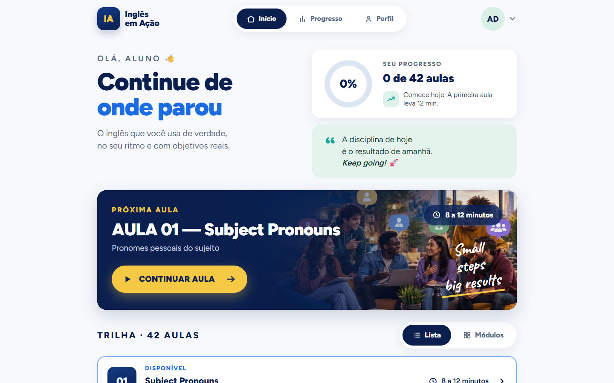
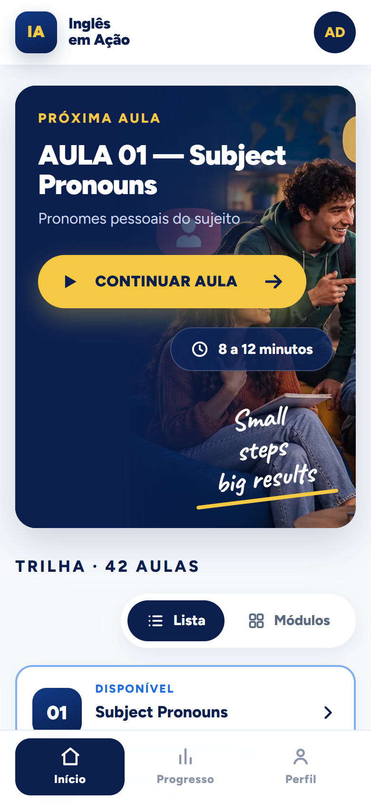
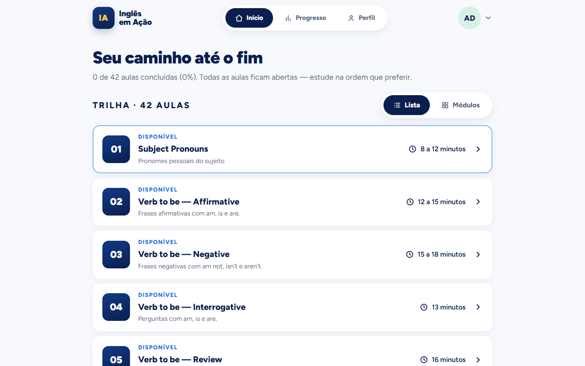
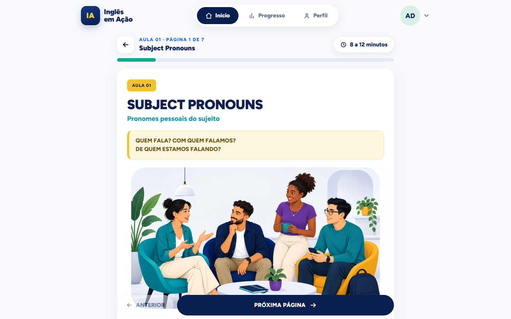
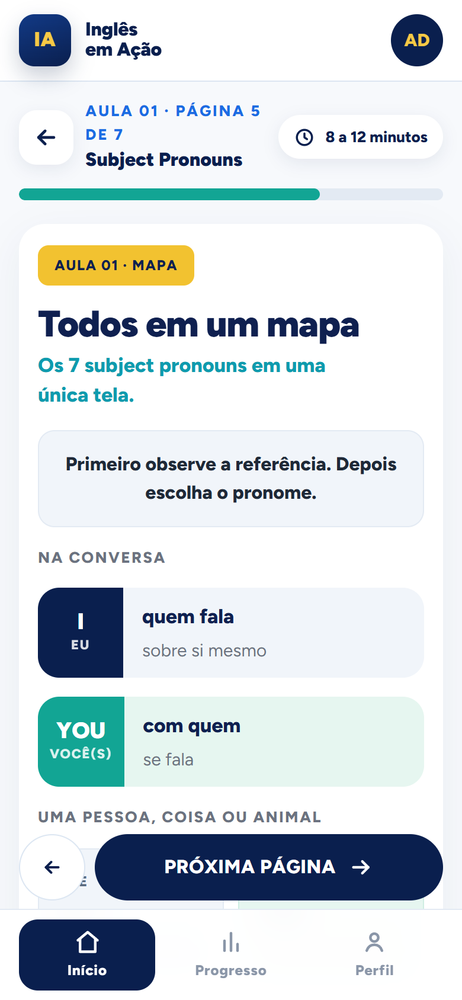
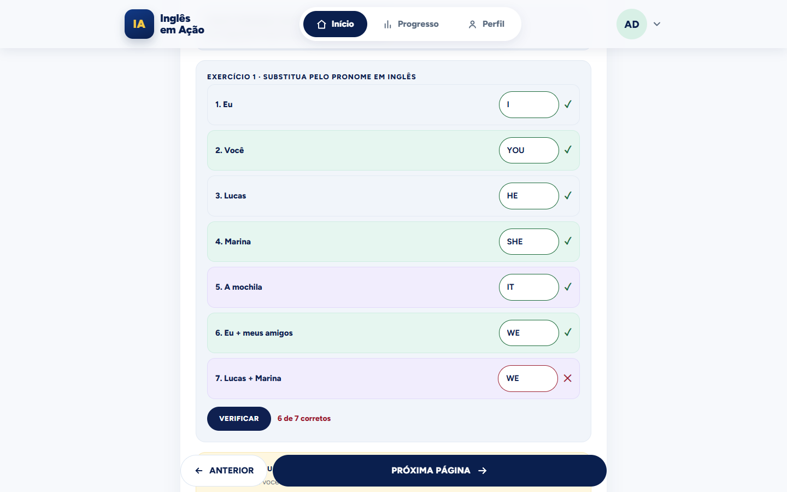
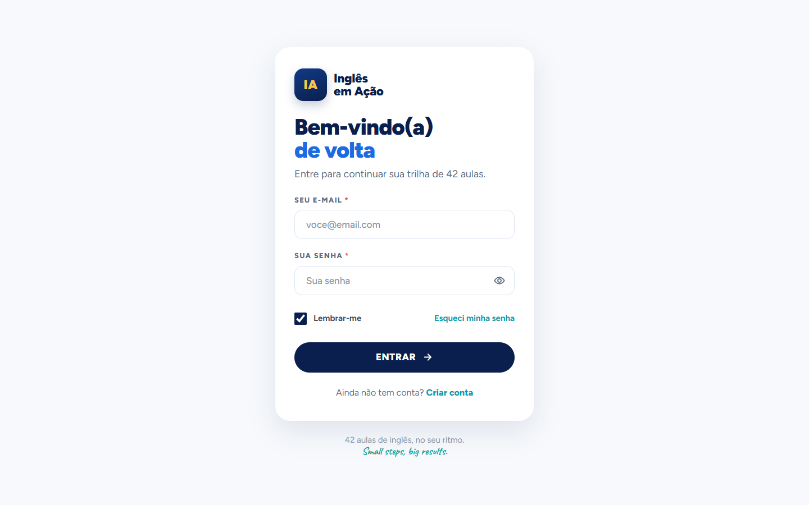
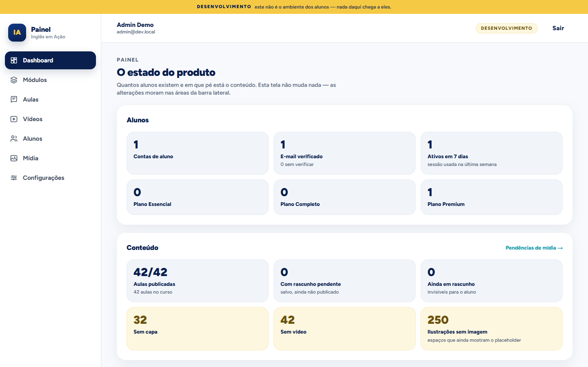
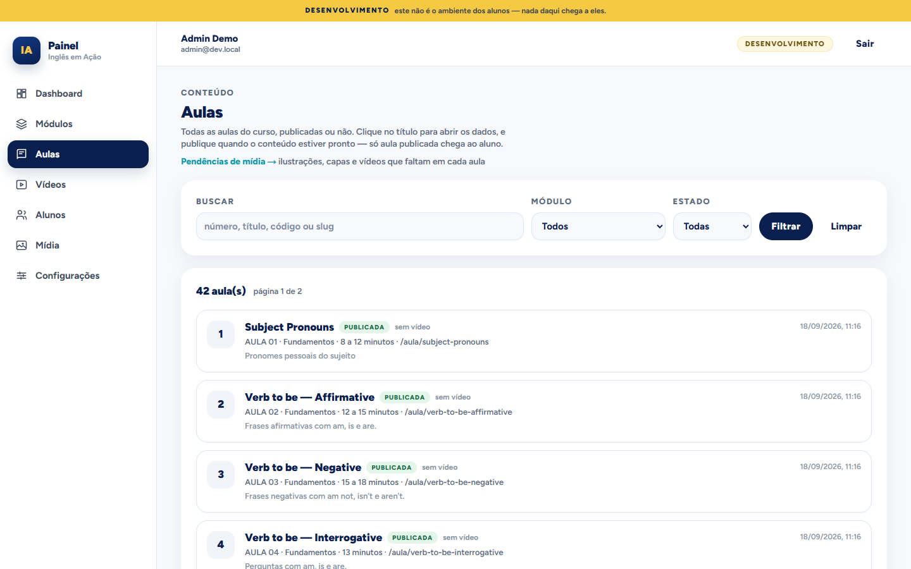

  

<h1 align="center">Inglês em Ação</h1>

  <strong>Do zero a falar de você em inglês, em 42 aulas curtas.</strong>

  O aplicativo do método <strong>WSA English</strong>: uma trilha guiada, aula por aula, 
  que mostra o tempo todo o que você já consegue dizer.

  42 aulas &nbsp;·&nbsp; 7 módulos &nbsp;·&nbsp; 309 páginas de e-book digital &nbsp;·&nbsp; feito primeiro para o celular

---

Muita gente já tentou aprender inglês e parou no meio do caminho: faltou tempo, o progresso não aparecia, bateu a sensação de "isso não é para mim". O **Inglês em Ação** existe para mudar essa história.

Ele não é um catálogo de vídeos, nem um PDF aberto na tela. É o e-book do método WSA English transformado em experiência digital, com páginas ilustradas, exercícios que respondem na hora e uma trilha que sempre mostra qual é o próximo passo.

## ✨ Por que é diferente

- **Começa do zero de verdade.** A Aula 01 parte dos pronomes pessoais e não cobra nada que ninguém ensinou. Cada aula se apoia apenas no que veio antes.
- **Você nunca fica sem saber o que fazer.** O app abre em *Continue de onde parou*, e a próxima aula fica a um toque.
- **O progresso aparece como coisas que você sabe fazer.** Além de contar aulas, o app mostra o que você já sabe fazer. Cada aula termina com uma lista **"Eu consigo..."** para você marcar suas conquistas reais.
- **Aulas curtas.** De 8 a 25 minutos, com o tempo estimado sempre à vista. Dá para encaixar mesmo num dia cheio.
- **Pode parar sem culpa.** Ficou duas semanas longe? Você volta exatamente de onde estava, sem bronca e sem recomeçar.
- **Errar faz parte.** Os exercícios mostram na hora o que você acertou e o que merece outra olhada. Quando o placar vem baixo, o app diz: *"Tudo bem errar. Revise a aula com calma e tente de novo."*

## 📱 Um passeio pelo app

### Início: continue de onde parou

Quem estuda sozinho sempre esbarra na mesma pergunta: *qual é o meu próximo passo?* A tela inicial já traz a resposta. Em destaque aparece a próxima aula, com a arte de capa, o tempo estimado e o botão **Continuar aula**. Ao lado ficam o seu progresso na trilha e uma frase para dar o empurrão do dia.

  
  &nbsp;
  

### A trilha: o seu caminho até o fim

As 42 aulas aparecem em ordem, cada uma com número, título, subtítulo em português, tempo estimado e situação. Você pode ver a lista inteira ou as aulas agrupadas por módulo e sabe sempre onde está e quanto falta.

  

### A aula: o e-book dentro do app

Cada aula é uma sequência de páginas digitais (309 ao todo) pensadas para a tela do celular. Elas trazem títulos grandes, notas de apoio, cartões coloridos, tabelas, diálogos e ilustrações. Uma barra no topo mostra quanto falta, e os botões **Anterior** e **Próxima página** deixam o ritmo com você.

  
  &nbsp;
  

### Exercícios que respondem na hora

Você digita, toca em **Verificar** e o resultado aparece na hora: os acertos ficam verdes, o que precisa de atenção fica vermelho e o placar sobe na tela. No exemplo abaixo, o item 7 pedia **THEY**, porque Lucas e Marina formam um grupo do qual você não faz parte. É exatamente esse tipo de detalhe que a aula ensina a perceber.

  

Os formatos variam para a prática não virar rotina:

- completar lacunas;
- testes relâmpago de múltipla escolha;
- ligar cada item ao seu par;
- montar frases arrastando (ou tocando) as peças;
- escrever frases suas;
- marcar, na lista "Eu consigo...", o que você já sabe fazer.

Suas respostas ficam guardadas. No fim da aula, uma tela de resultado mostra o seu aproveitamento e o caminho para a aula seguinte.

### Seu progresso, sempre à vista

Na aba **Progresso**, um anel mostra quanto da trilha você já percorreu. Junto dele aparecem as aulas concluídas, as respostas salvas e a sua sequência de estudo. Logo abaixo ficam o desempenho em cada aula concluída e o avanço em cada módulo.

### Sua conta, do seu jeito

Cada aluno tem a própria conta, com confirmação de e-mail, a opção **Lembrar-me** e recuperação de senha. Quem chega pela primeira vez encontra uma página que apresenta o método e, depois de criar a conta, a Aula 01 já está esperando. O app inteiro está em português, do primeiro clique ao último.

  

### Nos bastidores: o painel da equipe

A equipe WSA English tem um painel próprio para cuidar do curso. Por ele é possível:

- editar e publicar aulas, com rascunho antes de ir ao ar;
- organizar os módulos;
- enviar capas e ilustrações e cadastrar as videoaulas;
- acompanhar os alunos;
- ver de relance o que ainda falta de mídia em cada aula.

Assim o curso pode crescer e melhorar sem parar, direto pelo painel.

  
  &nbsp;
  

## 🧭 A jornada: 42 aulas em 7 módulos

A trilha segue a progressão do método WSA English. Primeiro vêm as bases, como os pronomes e o *verb to be*. Depois, vocabulário do dia a dia intercalado com gramática, até chegar ao passado. As Aulas 05 e 42 são de revisão e ajudam a juntar tudo antes de seguir.

  
  &nbsp;
  

  
  &nbsp;
  

| Módulo | Aulas | O que você estuda | O que você passa a conseguir |
|:---:|:---:|---|---|
| **1** | 01–06 | Subject Pronouns · Verb to be (afirmativa, negativa, perguntas e revisão) · Countries and Nationalities | Dizer quem é quem, se apresentar e contar de onde você é |
| **2** | 07–12 | Family · Numbers 1–100 · Days and Months · Colors and Shapes · Articles *a / an / the* · Plural Nouns | Falar da família, dizer idade, datas e preços e descrever objetos |
| **3** | 13–18 | This / That / These / Those · Possessive Adjectives · There is / There are · Prepositions of Place · Simple Present (afirmativa e negativa) | Apontar e localizar coisas, dizer o que existe num lugar e começar a falar do seu dia a dia |
| **4** | 19–24 | Simple Present (perguntas) · Adverbs of Frequency · Daily Routine · Telling the Time · Food and Drinks · Can / Can't | Perguntar sobre rotinas, dizer as horas e pedir comida e bebida |
| **5** | 25–30 | Imperatives · Present Continuous (afirmativa e perguntas) · Clothes · Weather · Jobs | Dar instruções, contar o que está acontecendo agora e falar de roupas, do tempo e de profissões |
| **6** | 31–36 | Directions · Like, Love, Dislike & Hate · How Often? · Can (habilidades) · Object Pronouns · Meals and Restaurant | Pedir e dar direções, falar do que gosta e fazer um pedido no restaurante |
| **7** | 37–42 | Count and Noncount Nouns · A lot of / Many / Much · Simple Past (verb to be, verbos regulares e irregulares) · Unit Review 2 | Falar de quantidades e contar o que você fez |

## 🚀 O que vem por aí

O Inglês em Ação está crescendo. Os itens abaixo são os próximos passos e **ainda não estão no ar**:

- 🎬 **Videoaulas com o professor.** O app já está preparado para exibir a videoaula de cada aula, e os vídeos das 42 aulas estão a caminho.
- 🎙️ **Prática oral com IA, sem plateia.** Você vai conversar em voz alta sobre o que acabou de estudar, com uma IA que conhece exatamente a aula em que você está e não cobra o que ainda não foi ensinado. Pode errar quantas vezes quiser, porque só você ouve.
- 💳 **Planos Essencial, Completo e Premium.** Todos seguem as mesmas 42 aulas e mudam só no que acompanha cada uma. O Completo acrescenta as videoaulas, e o Premium acrescenta também a prática oral com IA.
- 🖼️ **Mais arte nas aulas.** Capas e ilustrações para toda a trilha.
- 🏅 **Mais motivos para voltar.** Conquistas, metas semanais, lembretes de estudo e certificado de conclusão.

## 💛 Uma aula de cada vez

Aprender inglês não precisa ser uma maratona. Bastam um caminho claro, passos do tamanho do seu dia e alguém mostrando que você está chegando lá. O Inglês em Ação faz isso, uma aula de cada vez.

  <strong><em>Small steps, big results.</em></strong>

  Feito no Brasil, para quem quer usar o inglês de verdade.

---

Para desenvolvedores: a documentação técnica está na pasta <a href="docs/">docs</a>.

